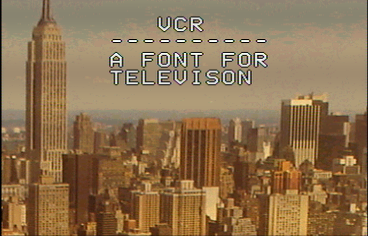

# The VCR Font Family

## Overview

VCR is monospaced bitmap font inspired by the overlay text used in
many video cassette recorders of the 1980s and 1990s.

The design is a two-color font of white text outlined in black.  As
the BDF font format does not support color, The white and black colors
have been split into two distinct font files.  The white inline
portions of each character is described in `vcr-normal-inline.bdf` and
the black outline portions are described in `vcr-normal-outline.bdf`.

The inline and outline fonts are meant to be overlaid in contrasting
colors (usually white for the inline and black for the outline,) in
order to achieve the final product.

## Installation

1. Copy or symlink the fonts to your ~/.fonts directory:
   `cp vcr-normal-*.bdf ~/.fonts`
2. Run `fc-cache -fv` to update your font cache.
